# Architecture: product-search

| | |
|---|---|
| **Author** | Divya Somashekar |
| **Last updated** | 2026-09-30 |
| **Related** | [RFC 0001](rfc/0001-product-search-engine.md) (why Elasticsearch) · [RFD 0001](rfd/0001-product-search-with-elasticsearch.md) (search design in depth) · [README](../README.md) (run and test) |

This document explains how the system is put together: which parts exist, what each one is
responsible for, and how product data moves from Postgres to Elasticsearch and back out to a
search result. Diagrams are Mermaid, so GitHub renders them.

---

## 1. The idea in one paragraph

**Postgres stores the products and Elasticsearch holds a copy organised for searching.** Every
change is written to Postgres first. After the change is committed, the same product is copied
into Elasticsearch. Searches read only from Elasticsearch; reading a single product by id reads
from Postgres. If the two ever disagree, Postgres wins and the Elasticsearch index is rebuilt from
it.

---

## 2. System context

Who and what the system talks to.

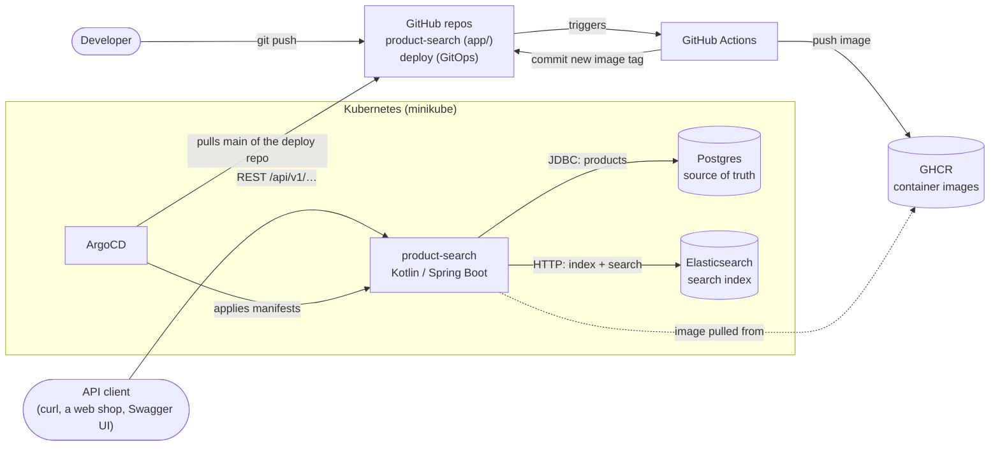

---

## 3. Responsibilities: why two data stores

| | Postgres | Elasticsearch |
|---|---|---|
| **Role** | Source of truth. A product exists only if it is here. | Derived search index. It can be thrown away and rebuilt from Postgres at any time. |
| **Good at** | Transactions, constraints (`price >= 0`), exact reads by id, durability | Typos, relevance ranking, highlighting, facets, fast full-text search |
| **Written by** | `ProductService` (create, update, delete) | `ProductIndexer` (after each commit), `ReindexService` (bulk rebuild) |
| **Read by** | `GET /products/{id}`, `GET /products`, reindex | `GET /products/search` only |
| **Schema** | Flyway: `app/src/main/resources/db/migration/V1__create_product.sql` | `app/src/main/resources/elasticsearch/products-index.json` |
| **Runs as** | pod `products-db-1`, managed by the CloudNativePG operator | pod `search-es-default-0`, managed by the ECK operator |
| **If it is down** | Writes and id reads fail (503/500); the pod goes *not ready* | Searches return 503; writes still succeed and are repaired later by reindex |

---

## 4. Components inside the service

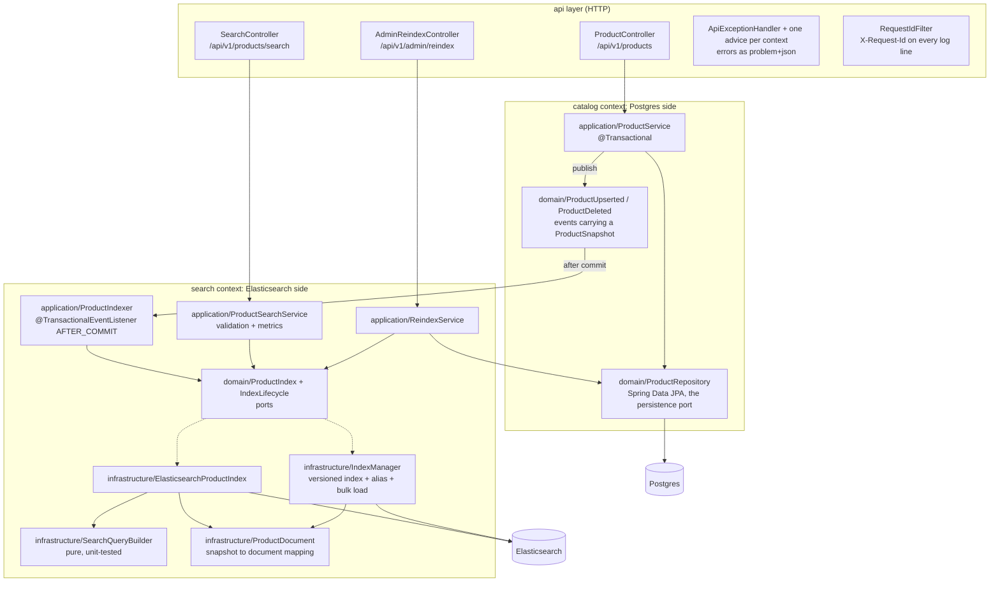

| Component | File | Responsibility |
|---|---|---|
| `ProductController` | `catalog/api/ProductController.kt` | CRUD endpoints; validates request bodies, maps them to a `ProductCommand` |
| `ProductService` | `catalog/application/ProductService.kt` | Writes to Postgres in a transaction and publishes a change event |
| `Product` | `catalog/domain/Product.kt` | The aggregate; produces the immutable `ProductSnapshot` everything else travels as |
| `ProductRepository` | `catalog/domain/ProductRepository.kt` | The persistence port: JPA access to table `product` |
| `ProductUpserted`, `ProductDeleted` | `catalog/domain/ProductChangedEvent.kt` | "Product changed" messages, carrying a snapshot of the product |
| `ProductIndex`, `IndexLifecycle` | `search/domain/` | The ports search is written against: query/index/delete via the alias, and the rebuild lifecycle |
| `ProductIndexer` | `search/application/ProductIndexer.kt` | After commit, copies the change to the index, retrying up to 3× |
| `ProductSearchService` | `search/application/ProductSearchService.kt` | Validates the criteria, runs the search through the port, records metrics |
| `ReindexService` | `search/application/ReindexService.kt` | First-start initialisation and zero-downtime rebuild from Postgres |
| `ElasticsearchProductIndex` | `search/infrastructure/ElasticsearchProductIndex.kt` | `ProductIndex` on Elasticsearch: runs the query, maps hits/highlights/facets |
| `IndexManager` | `search/infrastructure/IndexManager.kt` | `IndexLifecycle`: creates versioned indices from the JSON definition, bulk-loads, moves the alias |
| `SearchQueryBuilder` | `search/infrastructure/SearchQueryBuilder.kt` | Turns search criteria into an Elasticsearch query |
| `ProductDocument` | `search/infrastructure/ProductDocument.kt` | Converts a product snapshot into the Elasticsearch document and back |
| `SearchController` | `search/api/SearchController.kt` | Search endpoint; validates query parameters |
| `AdminReindexController` | `search/api/AdminReindexController.kt` | The reindex endpoint |
| `ApiExceptionHandler` | `shared/web/ApiExceptionHandler.kt` | Framework errors as RFC 9457 problems; each context adds an advice for its own failures |

The two contexts meet in exactly one place: the **events**, which carry a `ProductSnapshot`.
`catalog` never calls Elasticsearch and knows nothing about `search`; `search` never writes to
Postgres, and reads it only to rebuild the index. No Elasticsearch type appears outside
`search/infrastructure` — the adapter rewrites client failures as `SearchUnavailableException`.

---

## 5. Data model

### 5.1 Postgres: table `product`

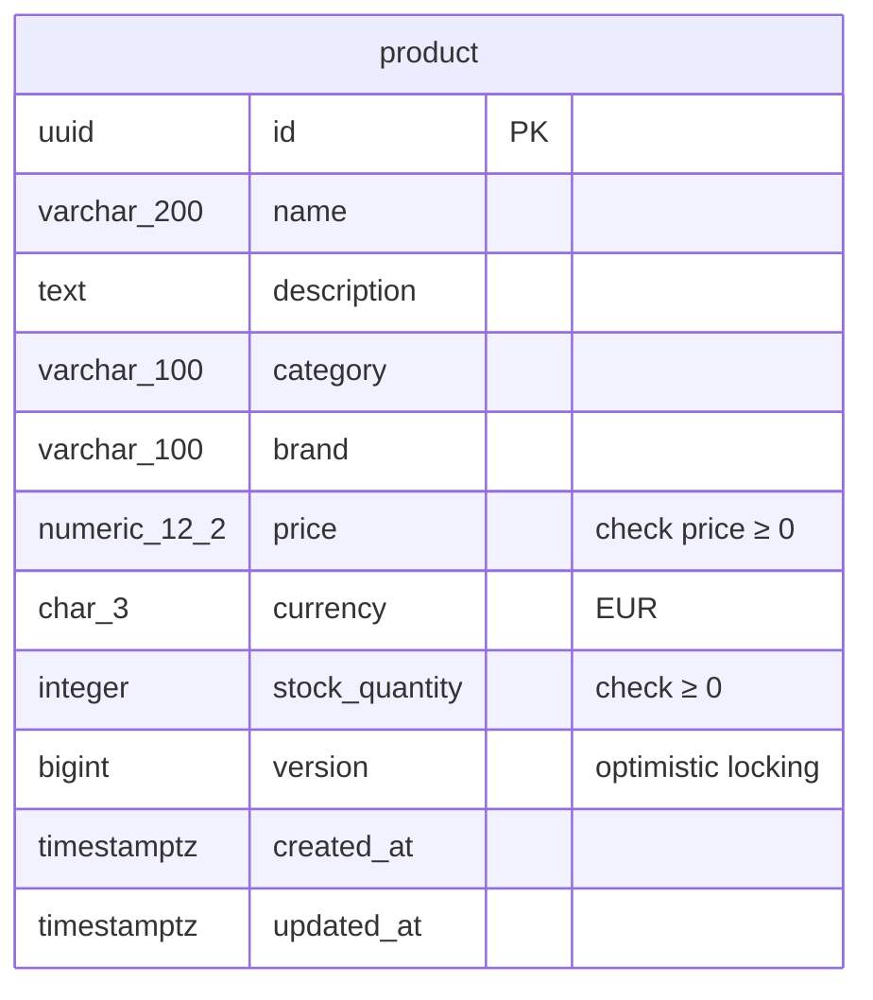

### 5.2 Elasticsearch: document in alias `products`

```json
{
  "id": "6f1c…",
  "name": "Sony WH-CH520 Wireless Headphones",
  "description": "Lightweight on-ear wireless headphones with 50-hour battery…",
  "category": "audio",
  "brand": "Sony",
  "price": 49.99,
  "currency": "EUR",
  "stockQuantity": 120,
  "inStock": true,
  "createdAt": "2026-09-30T15:01:12Z",
  "updatedAt": "2026-09-30T15:01:12Z"
}
```

### 5.3 How a row becomes a document

`ProductDocument.of(snapshot)` does the conversion. The `id` is the same in both stores; it is what
links a search hit back to the database row.

| Postgres column | Elasticsearch field | Mapping type | Notes |
|---|---|---|---|
| `id` | `id` | `keyword` | Same value; also the document `_id`; tie-break sort |
| `name` | `name` (+ `name.keyword`) | `text`, analyzer `product_text` | Searched with boost ×3, highlighted |
| `description` | `description` | `text`, `product_text` | Searched, highlighted |
| `category` | `category` (+ `category.text`) | lowercase `keyword` (+ `text`) | Exact filter and facet; also searchable (×2) |
| `brand` | `brand` (+ `brand.text`) | lowercase `keyword` (+ `text`) | Exact filter and facet; also searchable (×2) |
| `price` | `price` | `scaled_float` ×100 | Exact to the cent; range filter and sort |
| `currency` | `currency` | `keyword` | Display only (single-currency catalogue) |
| `stock_quantity` | `stockQuantity` | `integer` | Display |
| none | `inStock` | `boolean` | **Computed**: `stock_quantity > 0`, so availability is a cheap filter |
| `version` | none | none | Not copied; search doesn't need it |
| `created_at`, `updated_at` | `createdAt`, `updatedAt` | `date` | Display; future "newest" sort |

### 5.4 What Elasticsearch builds from the document

Elasticsearch doesn't search the JSON text. At index time, the analyzer (standard tokenizer →
lowercase → asciifolding) splits text fields into words and records which documents contain
each word, like the index at the back of a book:

```text
"wireless"   → Sony WH-CH520, JBL Tune 520BT, Anker Q30, Sennheiser HD 450BT, Logitech MX Keys, …
"headphones" → Sony WH-CH520, JBL Tune 520BT, Anker Q30, Sennheiser HD 450BT, Bose QC Ultra, …
"sony"       → Sony WH-1000XM5, Sony WH-CH520, Sony WF-C700N, DualSense Controller
```

A search looks words up in this *inverted index* (including near-miss spellings), intersects
the lists, and scores each document. That lookup is why search stays fast and typo tolerant.

---

## 6. Runtime flows

### 6.1 Create or update a product

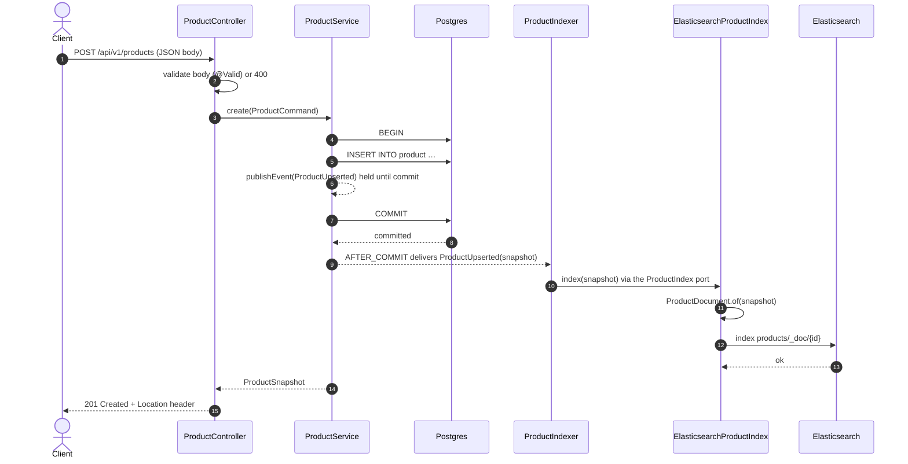

An update follows the same flow with `UPDATE` (the `version` column increases) and re-indexes the
document under the same id, replacing the previous one.

**Why after commit:** if the `INSERT` fails (say, a constraint violation), the transaction rolls
back and the event is never delivered. Elasticsearch can therefore never contain a product that
doesn't exist in Postgres.

### 6.2 Delete a product

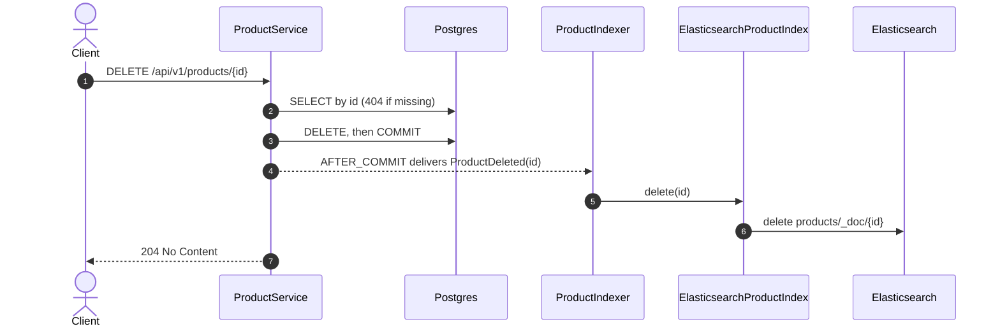

### 6.3 Search

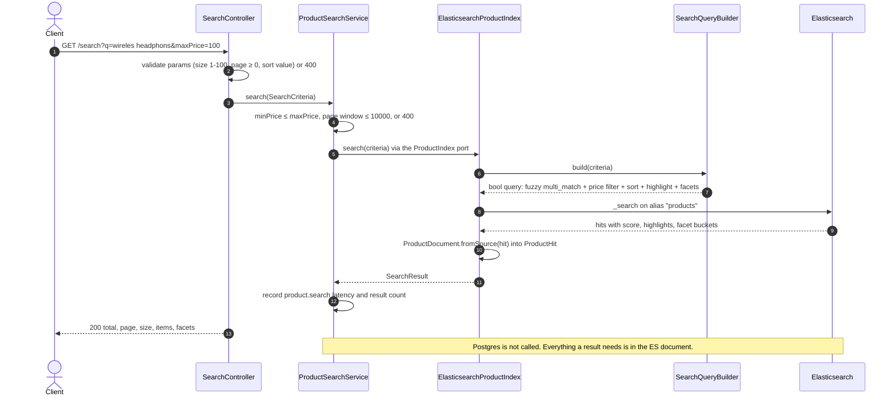

What happens inside Elasticsearch for `wireles headphons` ≤ €100:

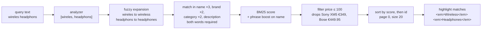

The query settings and why each has its value are explained in the RFD, §7.5.

### 6.4 First start: creating the index

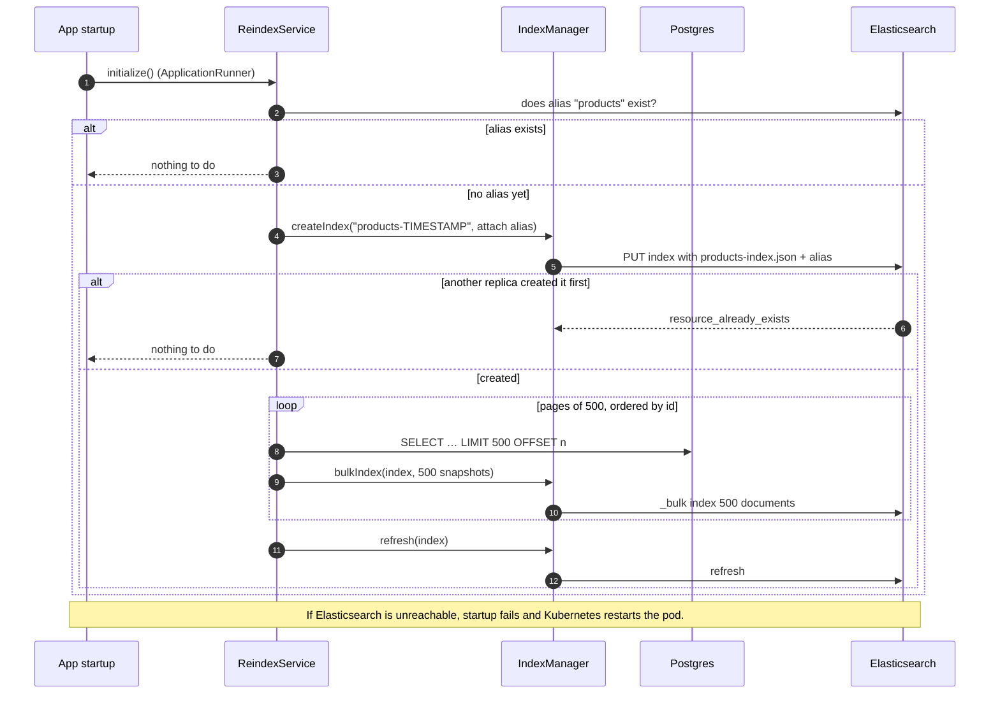

### 6.5 Rebuild: `POST /api/v1/admin/reindex`

Used to repair drift, or to apply a changed mapping, with no downtime.

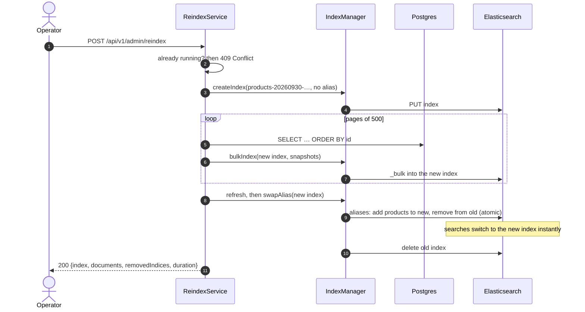

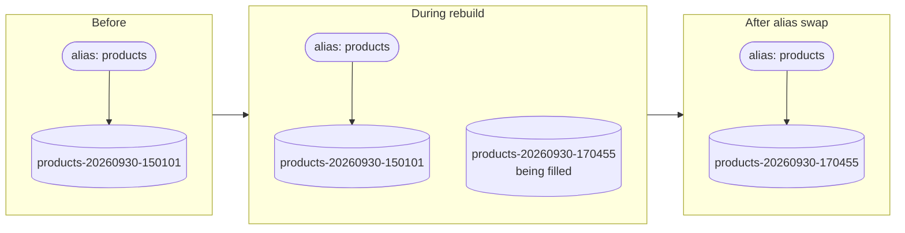

### 6.6 When Elasticsearch is down during a write

```mermaid
sequenceDiagram
    autonumber
    actor C as Client
    participant PS as ProductService
    participant PG as Postgres
    participant IX as ProductIndexer
    participant ES as Elasticsearch

    C->>PS: PUT /api/v1/products/{id}
    PS->>PG: UPDATE, then COMMIT (saved)
    PS-->>IX: AFTER_COMMIT ProductUpserted
    loop up to 3 attempts, backoff 200 ms, 400 ms
        IX-xES: index(snapshot) through the port; SearchUnavailableException
    end
    IX->>IX: log error + product.indexing.failures += 1
    PS-->>C: 200 OK (Postgres is the source of truth)
    Note over PG,ES: Postgres has the new price, search still shows the old one
    Note over C,ES: Repair: POST /api/v1/admin/reindex copies everything again
```

---

## 7. Which request touches which store

| Request | Postgres | Elasticsearch |
|---|---|---|
| `POST /api/v1/products` | write (insert) | write (index, after commit) |
| `PUT /api/v1/products/{id}` | write (update) | write (re-index, after commit) |
| `DELETE /api/v1/products/{id}` | write (delete) | write (delete, after commit) |
| `GET /api/v1/products/{id}` | read | none |
| `GET /api/v1/products` | read (paged) | none |
| `GET /api/v1/products/search` | none | read (search) |
| `POST /api/v1/admin/reindex` | read (all rows) | write (new index, alias swap) |
| App startup | read (only if no index yet) | write (first index) |

---

## 8. Consistency model

| Guarantee | Holds? | How |
|---|---|---|
| Search never shows a product that failed to save | ✅ | Indexing happens only after commit |
| A saved product becomes searchable | ✅ normally, within ~1 s | Elasticsearch refreshes about once per second; tests and local dev use `refresh=wait_for` for immediate visibility |
| Search always matches Postgres | 🟡 eventually | If Elasticsearch was down past the retries, search is stale until a reindex |
| Reads by id are always current | ✅ | They go to Postgres |
| No downtime when the mapping changes | ✅ | Versioned index plus atomic alias swap |
| Writes made during a reindex reach the new index | ❌ (known gap) | Run the reindex again, or add a transactional outbox (RFD §6.1) |

---

## 9. Deployment view

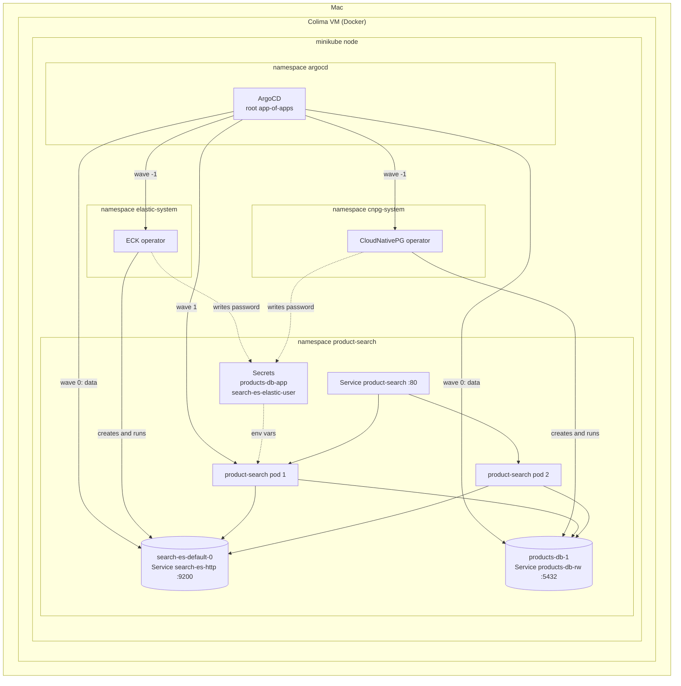

| ArgoCD app | Wave | Contents |
|---|---|---|
| `eck-operator` | -1 | Elastic's operator (Helm chart 3.5.0) |
| `cnpg-operator` | -1 | CloudNativePG operator (Helm chart 0.29.1) |
| `data` | 0 | `Elasticsearch` "search" (9.4.5, 1 node) and `Cluster` "products-db" (Postgres 18, 1 instance) |
| `product-search` | 1 | Deployment (2 replicas), Service, PodDisruptionBudget |

The app finds the databases through Kubernetes Services (`products-db-rw:5432`,
`search-es-http:9200`) and reads their passwords from Secrets the operators created. No
credentials are stored in Git.

---

## 10. Delivery pipeline

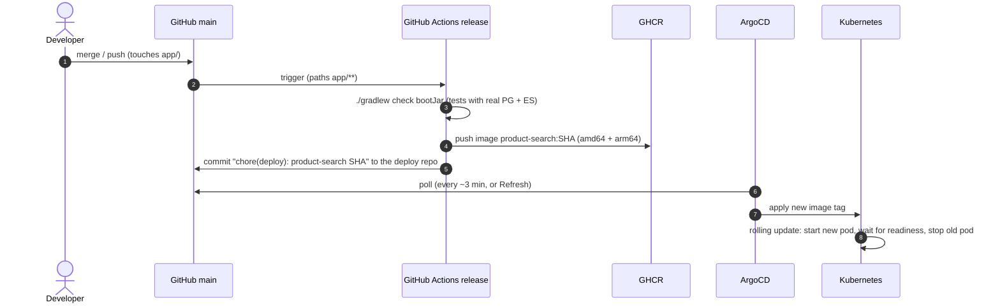

Changes in the deploy repo skip the Actions part entirely: ArgoCD applies them directly. Changes only to
docs trigger nothing.

---

## 11. Cross-cutting concerns

| Concern | Approach | Where |
|---|---|---|
| Configuration | Defaults in `application.yml` hold no hosts or secrets; the environment provides them (`SPRING_DATASOURCE_*`, `SPRING_ELASTICSEARCH_*`). Profiles: `local`, `demo`. | `app/src/main/resources/application*.yml`, the deploy repo's `services/product-search/base/deployment.yaml` |
| Schema changes | Postgres: Flyway migrations, and Hibernate validates the entity against them at startup. Elasticsearch: edit `products-index.json`, then reindex. | `db/migration/`, `elasticsearch/products-index.json` |
| Errors | RFC 9457 `application/problem+json`; no stack traces or internals leak to clients | `ApiExceptionHandler` |
| Health | Liveness = the JVM is alive. Readiness = Postgres **and** Elasticsearch reachable. Both on management port 8081. | `application.yml` → `management.*` |
| Metrics | Prometheus at `:8081/actuator/prometheus`: `product_search_seconds` (latency, tagged by sort and whether text was given), `product_search_results`, `product_indexing_failures_total` | `ProductSearchService`, `ProductIndexer` |
| Logs | Structured JSON (ECS) in Kubernetes; every line carries `requestId` (from `X-Request-Id` or generated) | `RequestIdFilter`, `logging.structured` |
| Concurrency | Optimistic locking on `version` (409 on a concurrent update); only one reindex at a time (409) | `Product`, `ReindexService` |
| Security (PoC level) | Non-root, read-only container; highlights HTML-escaped. **Gaps:** ES without TLS and using the `elastic` superuser, no auth on `/admin/reindex`, no NetworkPolicy | `deployment.yaml`, `SearchQueryBuilder`, RFD §8 |

---

## 12. Glossary

| Term | Meaning here |
|---|---|
| **Source of truth** | The store whose data wins when two disagree: Postgres |
| **Index** (Elasticsearch) | A collection of documents with a mapping, e.g. `products-20260930-150101123` |
| **Alias** | A stable name (`products`) that points at one index; moving it is atomic |
| **Mapping** | The Elasticsearch schema: field types and analyzers |
| **Analyzer** | Turns text into searchable words (tokenize, lowercase, fold accents) |
| **Inverted index** | Word → list of documents containing it |
| **Fuzziness** | Allowed typos, measured in edits (insert, delete, replace a letter) |
| **BM25** | The relevance scoring formula Elasticsearch uses |
| **Refresh** | When recent writes become visible to search (~1 s) |
| **Reindex** | Rebuild the whole index from Postgres into a new index, then swap the alias |
| **Operator** | A Kubernetes controller that runs a database for you from a short description (ECK, CloudNativePG) |
| **Sync wave** | ArgoCD ordering: lower waves are applied first |
