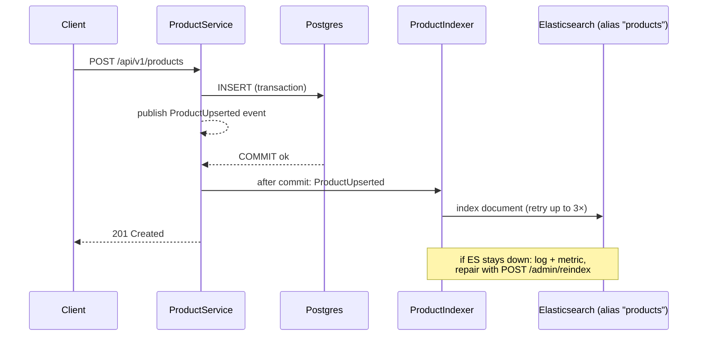
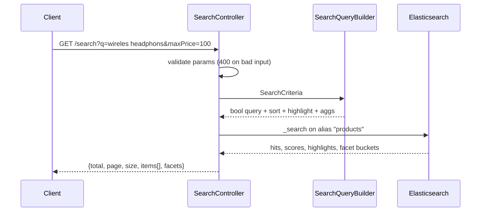

# RFD 0001: Product search with Elasticsearch

| | |
|---|---|
| **Status** | Accepted (implemented in this repo) |
| **Author** | Divya Somashekar |
| **Date** | 2026-09-30 |
| **Code** | `app/src/main/kotlin/com/example/productsearch/search/`, `app/src/main/resources/elasticsearch/products-index.json` |

## 1. Summary

Customers of an online store need to find products by typing what they are looking for,
including when they misspell it, and narrow the results by price and availability. This RFD
compares five ways to build that search, recommends **Elasticsearch next to Postgres**, with
Postgres as the source of truth and Elasticsearch as a rebuildable search index, and explains
how the implementation in this repository works.

## 2. Problem

### 2.1 Requirements

| # | Requirement | Example |
|---|---|---|
| R1 | Search across name, description, category and brand | "sony" matches the brand, "noise cancelling" matches the description |
| R2 | Typo-tolerant matching | "wireles headphons" still finds wireless headphones |
| R3 | Filter by price range and availability | "under €100", "in stock only" |
| R4 | Sort by relevance or price | best match first, or cheapest first |
| R5 | Pagination | page 2, 20 per page, with a total count |
| R6 | Show where the search matched | "Sony WH-CH520 <em>Wireless</em> <em>Headphones</em>" |
| R7 | Filters must be exact | a €100.01 item never appears under "≤ €100" |

Also desirable: facet counts for a filter sidebar (how many results per brand/category), and
fast responses (tens of milliseconds) as the catalogue grows.

### 2.2 Why a plain database query is not enough

The obvious first attempt, `WHERE name ILIKE '%wireles headphons%'`, fails on almost every
requirement:

- **No typo tolerance (R2).** `wireles` is not a substring of `wireless headphones`.
- **No relevance (R4).** Every match is equally good; there is no "best match first".
- **Word order and word forms matter.** "headphones wireless" does not match "wireless headphones".
- **No highlights (R6)** without extra application code.
- **Slow at scale.** A leading `%` cannot use a B-tree index, so every search scans the table.

Search is a different problem from storing data. It needs text analysis (splitting text into
words, lower-casing, folding accents), an **inverted index** (word → documents containing it),
relevance scoring, and fuzzy matching. Section 5 compares the tools that provide those.

### 2.3 Constraints

- Postgres already holds the product catalogue and is the **source of truth**. Products are
  created and updated through the service's API.
- A small team runs this, so every component added must pay for its operational cost.
- It runs on Kubernetes (locally on minikube), deployed by ArgoCD.

### 2.4 Non-goals

- Semantic or vector search ("something to block out noise on a plane"). See §9.
- Personalised ranking, search analytics, autocomplete-as-you-type (possible later).
- Multi-currency prices. The catalogue has one currency (EUR), which is what makes price
  filters meaningful.

## 3. Background: how a search engine answers a query

A short primer, because the options differ mainly in how well they do these steps.

1. **Analysis.** At write time, text is broken into *tokens*:
   `"Sony WH-CH520 Wireless Headphones"` becomes `[sony, wh, ch520, wireless, headphones]`
   (lower-cased, punctuation removed, accents folded: `kopfhörer` → `kopfhorer`). The query goes
   through the same analyzer, so both sides compare like with like.
2. **Inverted index.** For each token, a sorted list of the documents that contain it, like the
   index at the back of a book. Looking up a word is fast however many documents there are.
3. **Fuzzy matching.** A query token also matches tokens within a small *edit distance*
   (inserting, deleting or replacing letters): `wireles` → `wireless` is 1 edit, and
   `headphons` → `headphones` is 1 edit.
4. **Scoring (BM25).** Each match gets a relevance score. Rare words count more than common
   ones, matches in short fields count more than in long ones, and some fields can be boosted.
5. **Filtering.** Yes/no conditions (price ≤ 100, in stock). These don't affect the score and
   can be cached.
6. **Sorting, paging, highlighting, aggregations.** Order the results, return one page, mark the
   matched words in the text, and count results per category or brand.

## 4. Options

| | Option | In one line |
|---|---|---|
| A | **Postgres only**: full-text search (`tsvector`) plus `pg_trgm` for typos | No new infrastructure; search inside the existing database |
| B | **Elasticsearch next to Postgres** | Dedicated search engine; Postgres stays the source of truth |
| C | **OpenSearch next to Postgres** | Like B, using the Apache-2.0 fork of Elasticsearch |
| D | **Meilisearch or Typesense next to Postgres** | Lightweight search engines with typo tolerance built in |
| E | **Hosted search SaaS** (Algolia, Elastic Cloud) | Someone else runs the engine |

### 4.1 Option A: Postgres only

Add a generated `tsvector` column with a GIN index for full-text search, and `pg_trgm` (trigram)
indexes for typo-tolerant similarity. Extensions such as ParadeDB's `pg_search` add BM25 ranking
inside Postgres.

**Pros**
- No new system to run, secure, back up or keep in sync.
- Always consistent: search sees a write the moment the transaction commits.
- One query language (SQL); easy joins with other tables.

**Cons**
- Typo tolerance and relevance must be assembled by hand: combine `ts_rank` with trigram
  `similarity()`, tune thresholds, write it all in SQL.
- Highlighting (`ts_headline`) is slow on large texts, and facets are separate `GROUP BY` queries.
- Search load competes with transactional load on the same database.
- Relevance tuning is much coarser than a dedicated engine's (per-field boosts, phrase boosts,
  "minimum should match").

### 4.2 Option B: Elasticsearch next to Postgres (recommended)

Postgres stores products. Every change is copied into an Elasticsearch index that exists only
to answer searches, and can be rebuilt from Postgres at any time.

**Pros**
- Meets every requirement with built-in features: analyzers, fuzzy `multi_match`, BM25,
  `bool` filters, sorting, `highlight`, aggregations for facets.
- Very fine-grained relevance control (field boosts, phrase boosts, `minimum_should_match`,
  fuzziness settings), which is where search quality comes from.
- Scales horizontally (shards, replicas) and keeps search load off Postgres.
- Mature tooling: an official Java client, Kibana for exploring data, and an operator (ECK) that
  runs it on Kubernetes.
- The skill and the architecture carry over to large catalogues and to semantic search later.

**Cons**
- Another stateful system to run: memory hungry (JVM heap plus OS cache), needs monitoring and
  upgrades. On a laptop it competes for RAM; it was the reason Colima needed resizing.
- **Two copies of the data**, so they can disagree. We need a sync strategy (§6.1) and a way to
  repair drift (reindex).
- **Near-real-time**, not real-time: a write becomes searchable after the next refresh (about
  1 s by default).
- Licensing: Elasticsearch is offered under the Elastic License 2.0, SSPL or AGPLv3. Fine for
  internal use; worth checking before offering search as a service to others.

### 4.3 Option C: OpenSearch next to Postgres

The AWS-originated fork of Elasticsearch 7.10, now under the Linux Foundation, licensed Apache 2.0.

**Pros**
- Same architecture and nearly the same query language as B, so the same design applies.
- Permissive license; the natural choice on AWS (Amazon OpenSearch Service).

**Cons**
- The same operational weight and consistency concerns as B.
- The APIs have diverged since the fork: the official Elasticsearch client and newer
  Elasticsearch features don't carry over, and there is less community material for the current
  versions.
- On Kubernetes it has its own operator, which is less mature than ECK.

### 4.4 Option D: Meilisearch or Typesense next to Postgres

Search engines built for "search box" use cases, with typo tolerance, facets and highlighting on
by default.

**Pros**
- Excellent results for product search with almost no tuning; typo tolerance works immediately.
- Much lighter to run than Elasticsearch (a single binary, less memory).
- Simple HTTP APIs.

**Cons**
- Less control over relevance, and fewer query types for complex cases.
- Smaller ecosystem and fewer operators, integrations and experienced engineers.
- Scaling out and high-availability options are more limited (they vary by product and edition).
- Still two copies of the data, so the same sync problem as B and C.

### 4.5 Option E: Hosted search SaaS

Algolia, or Elastic Cloud (managed Elasticsearch).

**Pros**
- No servers to run; high availability, upgrades and scaling are handled for you.
- Algolia in particular gives very good product search out of the box, with analytics.

**Cons**
- Cost grows with records and requests; Algolia gets expensive at scale.
- Vendor lock-in (Algolia's API is proprietary) and data leaves your infrastructure.
- Doesn't run offline or on a laptop, which rules it out for this local PoC.
- Still needs the Postgres → search sync.

### 4.6 Comparison

✅ strong · 🟡 possible with effort or limits · ❌ weak or missing

| Criterion | A: Postgres | B: Elasticsearch | C: OpenSearch | D: Meili/Typesense | E: SaaS |
|---|---|---|---|---|---|
| R1 multi-field search | 🟡 | ✅ | ✅ | ✅ | ✅ |
| R2 typo tolerance | 🟡 (trigrams, hand-tuned) | ✅ | ✅ | ✅ (best default) | ✅ |
| R3/R7 exact filters | ✅ | ✅ | ✅ | ✅ | ✅ |
| R4 relevance quality and control | 🟡 | ✅ | ✅ | 🟡 (good default, less control) | ✅ |
| R6 highlighting | 🟡 (slow) | ✅ | ✅ | ✅ | ✅ |
| Facets | 🟡 (extra queries) | ✅ | ✅ | ✅ | ✅ |
| Consistency with the source of truth | ✅ immediate | 🟡 ~1 s, needs sync | 🟡 same | 🟡 same | 🟡 same |
| Operational cost | ✅ none added | ❌ highest | ❌ high | 🟡 low–medium | ✅ none (you pay) |
| Scales to large catalogues | 🟡 | ✅ | ✅ | 🟡 | ✅ |
| Runs locally / on Kubernetes | ✅ | ✅ (ECK) | ✅ | ✅ | ❌ |
| License / lock-in | ✅ | 🟡 ELv2/SSPL/AGPL | ✅ Apache 2.0 | ✅ MIT / 🟡 GPL | ❌ proprietary |
| Transferable skill / ecosystem | 🟡 | ✅ | 🟡 | 🟡 | 🟡 |

## 5. Recommendation

**Option B: Elasticsearch next to Postgres.** Postgres stays the source of truth, and
Elasticsearch is a derived, rebuildable index.

It is the only option that meets every requirement with built-in, well-understood features
*and* leaves full control over relevance, which decides whether customers find what they are
looking for. Its costs (operations and a second copy of the data) are real but manageable:
ECK removes most of the operational work on Kubernetes, and treating the index as disposable
(§6.1, §6.2) keeps the data problem small.

When I would choose differently:
- **Option A (Postgres only)** for a small catalogue (thousands of products), a tiny team, or
  when "search sees every write immediately" is a hard requirement. It avoids the whole sync
  problem.
- **Option C (OpenSearch)** if the Apache-2.0 license matters, or when running on AWS's managed
  service. The design in this RFD applies almost unchanged.
- **Option D (Meilisearch/Typesense)** when good results with minimal tuning and minimal
  infrastructure matter more than relevance control and scale.

## 6. Sub-decisions

### 6.1 Keeping Elasticsearch in step with Postgres

| Approach | How | Pros | Cons |
|---|---|---|---|
| **1. Index after commit** (chosen for now) | After the database transaction commits, the service writes the product to ES, with retries | Simple; no extra infrastructure; a rolled-back write never reaches ES | If ES is down past the retries, that change is missed until a reindex; adds latency to the write request |
| 2. Dual write inside the transaction | Write to ES before committing | Simple | If the commit then fails, ES holds a product that doesn't exist. **Rejected.** |
| 3. Transactional outbox | Write an "outbox" row in the same transaction; a background worker sends it to ES | Guaranteed delivery; retries survive restarts; write requests aren't slowed by ES | More code (worker, cleanup, ordering) |
| 4. Change data capture (Debezium) | Stream Postgres's write-ahead log through Kafka into ES | Captures *every* change, including ones made outside the service | Kafka and Debezium are heavy for a PoC |
| 5. Periodic full reindex only | Rebuild on a schedule | Trivial | Search is stale between runs |

**Decision:** approach 1, plus a full reindex endpoint as the repair tool. Failures are counted
in the metric `product.indexing.failures`, which is what an alert would watch. **Move to 3 (outbox)**
as soon as a missed update matters in practice.

### 6.2 Changing the mapping without downtime: versioned index plus alias

The application reads and writes an **alias**, `products`, never a concrete index. A reindex
creates `products-<timestamp>`, fills it from Postgres, then moves the alias to it in one atomic
step and deletes the old index. Mapping changes (a new field, a different analyzer) therefore
never need downtime. The alternative, dropping and recreating a fixed index, leaves search
empty or broken while the index rebuilds.

Known gap: writes that arrive *during* a reindex go to the old index and are not copied over.
The outbox (§6.1, approach 3) or running the reindex again closes it.

### 6.3 Pagination

`from`/`size` (page number × size), capped at 10 000 results. It's simple and supports "jump to
page 7", which is how store search pages behave. Deep paging or exports would use `search_after`
(cursor-based) instead. It's not needed now.

### 6.4 Running Elasticsearch on Kubernetes

ECK (Elastic's operator) over a hand-written StatefulSet or Helm chart. About 15 lines of YAML
describe the cluster, and the operator handles certificates, passwords, rolling upgrades and
scaling. Elastic Cloud (option E) would remove even that, but doesn't run locally.

## 7. How it works in this project

### 7.1 Components

| Class | Responsibility |
|---|---|
| `IndexManager` | Creates versioned indices from `products-index.json`, moves the alias, refreshes |
| `ProductIndexer` | After each committed write, indexes or deletes the product in ES (with retries); bulk loading for reindex |
| `ReindexService` | First-start initialisation; zero-downtime full rebuild from Postgres |
| `SearchQueryBuilder` | Turns the request parameters into an Elasticsearch query (pure, unit-tested) |
| `ProductSearchService` | Runs the query, maps hits, highlights and facets to the API response; records metrics |
| `SearchController` | `GET /api/v1/products/search`, `POST /api/v1/admin/reindex` |

### 7.2 Write path



### 7.3 Search path



Search never touches Postgres. Everything the result needs is stored in the ES document.

### 7.4 Index mapping (`products-index.json`)

| Field | Type | Used for |
|---|---|---|
| `name` | `text` (analyzer `product_text`) + `name.keyword` | full-text search (boost ×3), highlighting |
| `description` | `text` (`product_text`) | full-text search, highlighting |
| `category`, `brand` | `keyword` (lower-cased) + `.text` subfield | exact filters and facets; also searchable text (boost ×2) |
| `price` | `scaled_float`, factor 100 | range filter, sort. Stored as whole cents, so €99.99 stays exact |
| `inStock` | `boolean` | availability filter |
| `id`, `currency`, `stockQuantity`, `createdAt`, `updatedAt` | keyword / integer / date | tie-break sort, display |

`product_text` = standard tokenizer → lowercase → asciifolding. The mapping is `dynamic: strict`,
so a typo in a field name fails loudly instead of silently creating a new field.

### 7.5 The query

For `q=wireles headphons&maxPrice=100&sort=relevance`, `SearchQueryBuilder` produces
(abridged):

```json
{
  "query": {
    "bool": {
      "must": [{
        "multi_match": {
          "query": "wireles headphons",
          "fields": ["name^3", "brand.text^2", "category.text^2", "description"],
          "type": "best_fields", "tie_breaker": 0.3,
          "fuzziness": "AUTO", "prefix_length": 1,
          "minimum_should_match": "2<75%"
        }
      }],
      "should": [{ "match_phrase": { "name": { "query": "wireles headphons", "slop": 2, "boost": 2 } } }],
      "filter": [{ "range": { "price": { "lte": 100.0 } } }]
    }
  },
  "sort": [{ "_score": "desc" }, { "id": "asc" }],
  "from": 0, "size": 20, "track_total_hits": true,
  "highlight": { "encoder": "html", "pre_tags": ["<em>"], "post_tags": ["</em>"],
                 "fields": { "name": { "number_of_fragments": 0 }, "description": { "fragment_size": 150 } } },
  "aggs": { "category": { "terms": { "field": "category" } }, "brand": { "terms": { "field": "brand" } } }
}
```

What each part does, and why:

| Part | Effect | Why this value |
|---|---|---|
| `fields` with `^3` / `^2` | A match in the name counts 3× a description match | The name is the strongest signal of what a product *is* |
| `fuzziness: AUTO` | 0 typos allowed for 1–2 letter words, 1 for 3–5, 2 for longer | Tolerates real typos without matching everything |
| `prefix_length: 1` | The first letter must be right | Cheaper fuzzy expansion; people rarely mistype the first letter |
| `minimum_should_match: "2<75%"` | Queries of 1–2 words need all words; longer queries need 75% | With plain `75%`, "wireless headphones" needed only one word and returned a wireless *keyboard*. An integration test guards this. |
| `best_fields` + `tie_breaker` | Scores by the best-matching field, plus a bit for other fields | `cross_fields` would combine fields better but doesn't support fuzziness |
| `match_phrase` in `should` | Extra score when the words appear together in the name | "Wireless Headphones" ranks above text that merely mentions both words |
| `filter` | Price/stock/category/brand as yes/no conditions | No effect on score, cached by ES, exact: R7 |
| sort tie-break on `id` | Equal scores always come back in the same order | Pages don't shuffle or repeat items between requests |
| `encoder: html` | Product text is HTML-escaped before `<em>` is added | Product data can never inject markup into a page (tested with a `<script>` name) |
| `aggs` | Counts per category/brand in the result set | Facets for a filter sidebar |

### 7.6 Walk-through: why "wireles headphons" ≤ €100 returns what it does

1. The analyzer turns the query into `[wireles, headphons]`.
2. Fuzzy matching expands `wireles` → `wireless` (1 edit) and `headphons` → `headphones` (1 edit).
3. `2<75%` means both words must match within a single field. The Logitech *keyboard* (only
   "wireless") drops out; the Sennheiser HD 450BT stays, because its **description** contains both.
4. BM25 scores the rest; name matches score highest, and the phrase boost lifts names that say
   "Wireless Headphones" together.
5. The price filter removes the €349 Sony WH-1000XM5 and the €449.95 Bose.
6. Result (verified on the minikube deployment, 2026-09-30): Sony WH-CH520 €49.99, JBL Tune
   520BT €44.90, Anker Soundcore Life Q30 €79.99, Sennheiser HD 450BT €99.00, each with
   `<em>`-highlighted matches.

### 7.7 Consistency and failure behaviour

| Situation | Behaviour |
|---|---|
| Normal write | Searchable after the next refresh (≤ ~1 s). Tests and local dev use `refresh=wait_for`, so it's immediate there. |
| ES slow or down during a write | 3 attempts with backoff. The write still succeeds; the failure is logged and counted. Repair with `POST /api/v1/admin/reindex`. |
| ES down during a search | HTTP 503 problem response ("Search is temporarily unavailable"). The pod turns *not ready* (readiness includes ES), so Kubernetes stops routing to it. |
| ES down at startup | The app fails to start and Kubernetes restarts it, rather than serving broken search. |
| Two replicas start at once | Creating the first index is atomic: one wins, the other sees it exists. |
| Mapping change | Deploy the new `products-index.json`, call reindex, and the alias switches with no downtime. |

## 8. Risks

| Risk | Mitigation |
|---|---|
| Index drifts from Postgres (missed update) | `product.indexing.failures` metric plus reindex; outbox as the next step |
| ES memory pressure (on the laptop and in production) | Explicit heap and limits (ECK podTemplate); monitor JVM heap |
| Relevance changes break results unnoticed | Relevance is covered by integration tests with concrete queries; add a test for each tuning change |
| Security shortcuts in the PoC | ES without TLS and using the `elastic` superuser; reindex endpoint without auth. Must be fixed before real use: TLS, a dedicated least-privilege ES user, auth on `/admin/*` |
| Deep paging abuse (`page=9999`) | Rejected with 400 beyond 10 000 results |

## 9. Future work

1. **Transactional outbox** for guaranteed indexing (§6.1).
2. **Autocomplete** with `search_as_you_type` fields or a completion suggester.
3. **Synonyms** ("earphones" = "earbuds" = "in-ear") via a synonym token filter; needs a reindex.
4. **Multi-select facets** that don't narrow their own counts (`post_filter` plus filtered aggregations).
5. **Semantic search**: add a `dense_vector` field with embeddings and combine it with the text
   query (hybrid search), so descriptive queries match products without shared keywords.
6. **Search analytics**: log zero-result queries to find missing synonyms and products.
